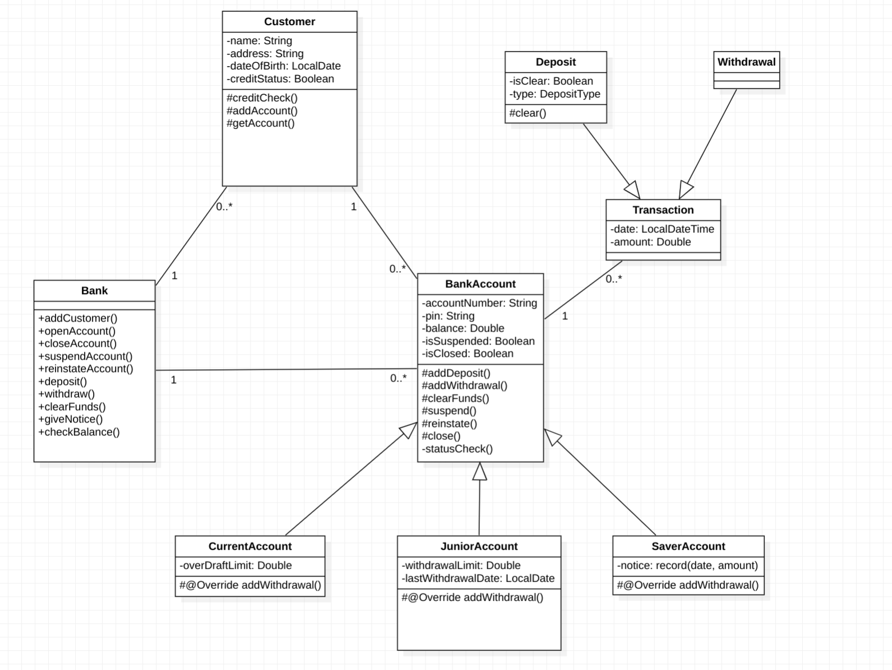

# A Simple Banking System

It acts as a library and does not provide any user interface or excutable.

Tests are provided in `src/test/java`.

## How To Build

```shell
$ ./gradlew build
```

## UML diagram


